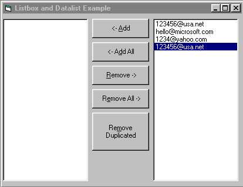



## Listbox and Datalist

### Description

This example will show you how to move items from datalist (which is connected to ADO control) to a listbox.
 
### More Info
 

             |
---                |---
**Submitted On**   |2001-08-05 22:09:22
**By**             |[louie](https://github.com/Planet-Source-Code/PSCIndex/blob/master/ByAuthor/louie.md)
**Level**          |Intermediate
**User Rating**    |4.2 (25 globes from 6 users)
**Compatibility**  |VB 6\.0
**Category**       |[Databases/ Data Access/ DAO/ ADO](https://github.com/Planet-Source-Code/PSCIndex/blob/master/ByCategory/databases-data-access-dao-ado__1-6.md)
**World**          |[Visual Basic](https://github.com/Planet-Source-Code/PSCIndex/blob/master/ByWorld/visual-basic.md)
**Archive File**   |[Listbox an24146852001\.zip](https://github.com/Planet-Source-Code/louie-listbox-and-datalist__1-25886/archive/master.zip)

